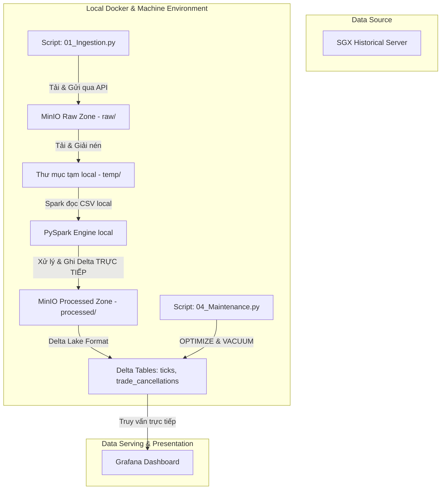

# SGX Derivatives Local Lakehouse Pipeline (Docker & Airflow Edition)

Một hệ thống **Local Data Lakehouse Pipeline** hoàn chỉnh, tự động hóa toàn diện và miễn phí 100%, được thiết kế để chạy trên máy cá nhân sử dụng **Docker**, **Apache Airflow**, **MinIO (S3-compatible)** và **PySpark** nhằm nạp (Ingestion), xử lý (Processing), lưu trữ (Delta Lake) và phân tích dữ liệu phái sinh lịch sử hàng ngày từ Sở giao dịch Chứng khoán Singapore (**SGX - Singapore Exchange**).

---

## 🛠️ Công nghệ cốt lõi

Dự án áp dụng mô hình **Modern Data Stack Local** với các công nghệ:


---

## 📐 1. Kiến trúc luồng dữ liệu (Local Architecture)

Quy trình dữ liệu được lập lịch tự động bằng **Airflow**, chạy xử lý song song bằng **Spark Local JVM** và lưu trữ thành phẩm Delta Lake trên **MinIO Object Store**:



---

## 📁 2. Cấu trúc thư mục (Project Structure)

```text
SGX_Derivatives_Daily_Downloader/
├── local_pipeline/              # 🖥️ MÔI TRƯỜNG LOCAL (Docker, Airflow, MinIO, PySpark)
│   ├── 01_Ingestion.py          # Tải dữ liệu thô từ SGX -> MinIO (Raw Zone)
│   ├── 02_ETL_Tick_Data.py      # PySpark ETL xử lý dữ liệu Ticks -> Delta Table local
{{ ... }}
│   ├── dags/
│   │   └── sgx_daily_pipeline.py# Airflow DAG tự động hóa chuỗi 4 task trên Docker
│   ├── docker/
│   │   ├── Dockerfile           # Custom image tích hợp Java 17 + PySpark cho Airflow
│   │   └── docker-compose.yml   # Khởi động PostgreSQL, Airflow và MinIO
│   └── requirements.txt         # Các thư viện Python cần thiết để chạy trên máy host
│
├── databricks_pipeline/         # [Template] Để dành khi cần di chuyển lên Cloud Databricks
│   ├── 01_Ingestion.py          # Notebook nạp dữ liệu thô từ SGX -> AWS S3 (Raw Zone)
│   ├── 02_ETL_Tick_Data.py      # Notebook ETL xử lý dữ liệu Ticks -> Delta Table
│   ├── 02_ETL_Trade_Cancel.py   # Notebook ETL xử lý dữ liệu Hủy lệnh -> Delta Table
│   ├── 03_Backfill.py           # Notebook nạp bù dữ liệu hàng loạt nhiều ngày trên Cloud
│   ├── 04_Maintenance.py        # Notebook tối ưu hóa Delta Lake (OPTIMIZE & VACUUM)
│   └── DATABRICKS_S3_GUIDE.md   # Hướng dẫn chi tiết vượt giới hạn S3 trên Databricks
│
├── dashboard/                   # [Tùy chọn] Backend API cũ nếu không muốn dùng Grafana
│   ├── app.py                   # FastAPI backend kết nối trực tiếp với MinIO
│   ├── requirements.txt         # Các gói Python phục vụ backend
│   └── OPTIMIZATION_GUIDE.md    # Hướng dẫn tối ưu hóa Cache
│
└── README.md                    # Tài liệu tổng quan dự án (File này)
```

---

## 🚀 3. Hướng dẫn cài đặt & Chạy tự động ở Local

### Bước 1: Khởi chạy môi trường Docker
Di chuyển vào thư mục docker của local pipeline và chạy Docker Compose để khởi động hệ thống containers (Postgres, MinIO, Airflow):
```powershell
cd local_pipeline/docker
docker-compose up -d --build
```
*Giao diện bảng điều khiển các dịch vụ local:*
*   **Airflow Web UI**: `http://localhost:8080` (Tài khoản/Mật khẩu mặc định: `admin` / `admin`).
*   **MinIO Console**: `http://localhost:9001` (Tài khoản/Mật khẩu mặc định: `minioadmin` / `minioadmin`).

### Bước 2: Theo dõi và Kích hoạt trên Airflow
1. Truy cập `http://localhost:8080` và đăng nhập bằng tài khoản `admin` / `admin`.
2. Tìm kiếm DAG `sgx_derivatives_daily_pipeline`.
3. Gạt công tắc bên trái tên DAG sang màu xanh (**Unpause**) để kích hoạt lịch chạy tự động vào lúc **22:00 hàng ngày (Thứ 2 - Thứ 6)**.
4. Bạn có thể nhấn nút **Trigger DAG** (nút Play bên phải) để chạy thử nghiệm pipeline lập tức cho ngày hôm nay.

### Bước 3: Chạy nạp bù thủ công local (Backfill)
Nếu bạn muốn nạp bù dữ liệu lịch sử trong một khoảng thời gian dài ở local mà không muốn trigger từng ngày trên giao diện Airflow:
1. Đảm bảo container MinIO đang chạy (`docker-compose up -d minio`).
2. Di chuyển vào thư mục `local_pipeline` và cài đặt các thư viện cần thiết ở máy host:
   ```powershell
   cd local_pipeline
   pip install -r requirements.txt
   ```
3. Chạy lệnh backfill (ví dụ nạp bù toàn bộ tháng 3 và tháng 4 năm 2026):
   ```powershell
   python 03_Backfill.py --start-date 2026-03-01 --end-date 2026-04-30
   ```

---

## 📊 4. Cấu hình Giám sát qua Grafana
Để trực quan hóa dữ liệu phái sinh từ SGX sau khi đã được lưu trữ trong MinIO:

### Cách A: Kết nối trực tiếp S3/MinIO Delta Tables qua AWS Athena / DuckDB
1. Cấu hình nguồn dữ liệu trỏ vào bucket `sgx-lakehouse` trên MinIO.
2. Sử dụng câu lệnh SQL trực tiếp trên Grafana để vẽ các chỉ số thị trường (Volume, Price, Trade Count).

### Cách B: Sử dụng FastAPI Backend API làm nguồn dữ liệu JSON
1. Di chuyển vào thư mục `dashboard/` và tạo file `.env`:
   ```env
   AWS_ACCESS_KEY_ID=your_access_key
   AWS_SECRET_ACCESS_KEY=your_secret_key
   AWS_DEFAULT_REGION=ap-southeast-1
   AWS_BUCKET_NAME=sgx-derivatives-daily-data-079
   ```
2. Cài đặt thư viện & Khởi chạy API server:
   ```powershell
   pip install -r requirements.txt
   python app.py
   ```
3. Trên Grafana, cài đặt plugin **JSON API** hoặc **Infinity** và cấu hình nguồn dữ liệu trỏ vào endpoint:
   * URL lấy danh sách ngày có sẵn: `http://localhost:8000/api/available-dates`
   * URL lấy dữ liệu phân tích chi tiết của một ngày: `http://localhost:8000/api/dashboard-data?date=YYYY-MM-DD`

---

## 🛠️ 6. Bảo trì & Tối ưu hóa Delta Lake
Delta Tables lưu trên Cloud cần được dọn dẹp định kỳ để tránh sinh file rác phiên bản cũ (vốn gây tăng chi phí lưu trữ S3). 

Notebook `04_Maintenance.py` thực hiện:
*   **OPTIMIZE**: Nén các file phân tán nhỏ thành các file lớn hơn để tối ưu hóa IO khi quét dữ liệu.
*   **VACUUM RETAIN 168 HOURS**: Dọn dẹp triệt để các phiên bản cũ đã tồn tại hơn 7 ngày, giúp giảm dung lượng lưu trữ trên bucket.

---

> [!IMPORTANT]
> **Khuyến nghị Vận hành Cloud**: Luôn giữ `date` trống trong Databricks Workflow để hệ thống tự động dò tìm dữ liệu hàng ngày. Chỉ sử dụng Notebook `03_Backfill.py` khi cần nạp bù khối lượng lớn dữ liệu lịch sử.
