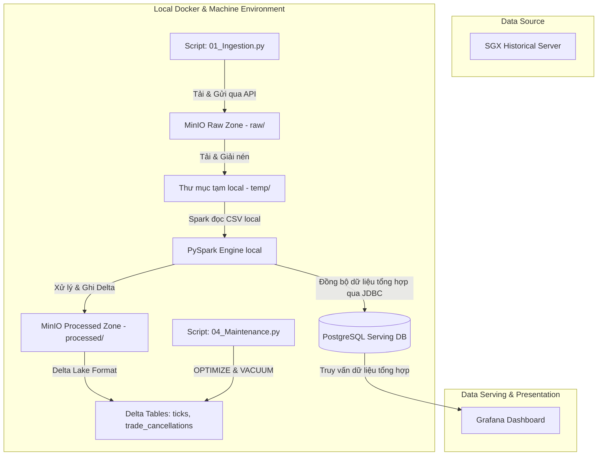
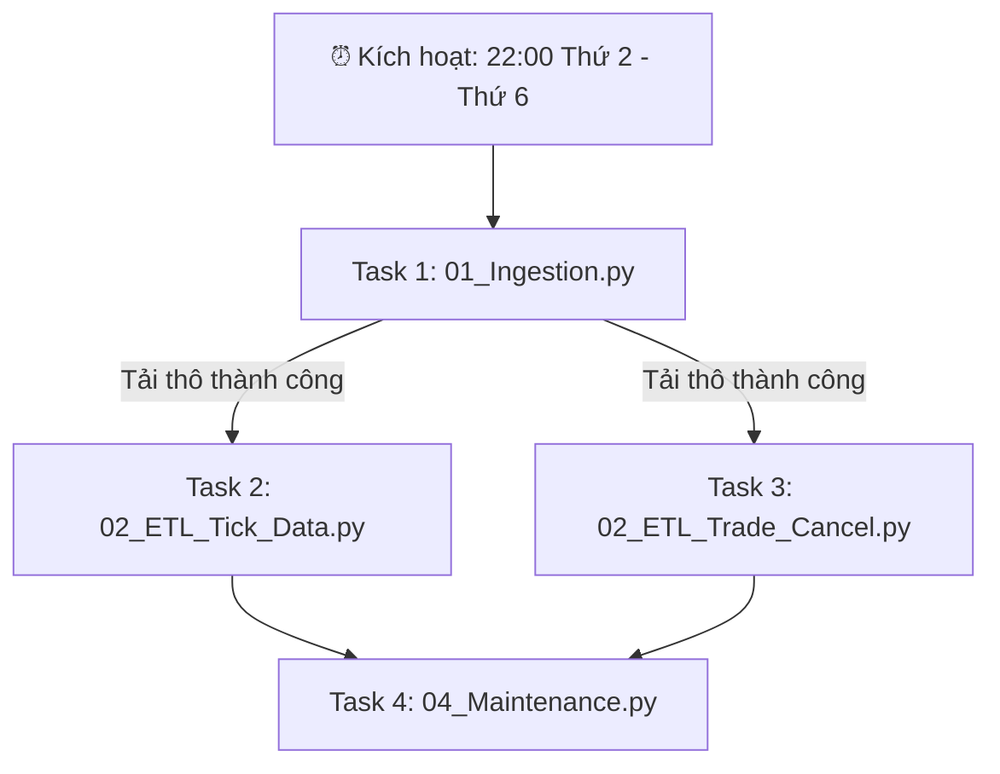

# SGX Derivatives Local Lakehouse Pipeline (Docker & Airflow Edition)

Một hệ thống **Local Data Lakehouse Pipeline** hoàn chỉnh, tự động hóa toàn diện và miễn phí 100%, được thiết kế để chạy trên máy cá nhân sử dụng **Docker**, **Apache Airflow**, **MinIO (S3-compatible)** và **PySpark** nhằm nạp (Ingestion), xử lý (Processing), lưu trữ (Delta Lake) và phân tích dữ liệu phái sinh lịch sử hàng ngày từ Sở giao dịch Chứng khoán Singapore (**SGX - Singapore Exchange**).

---

## 🛠️ Công nghệ cốt lõi

Dự án áp dụng mô hình **Modern Data Stack Local** với các công nghệ và vai trò cụ thể:

| Công nghệ | Vai trò & Chức năng trong hệ thống |
| :--- | :--- |
| **** | **Đóng gói dịch vụ**: Chạy các container độc lập cho PostgreSQL, Apache Airflow, và MinIO ở local giúp dễ dàng triển khai và tránh xung đột môi trường. |
| **** | **Orchestrator (Bộ điều phối)**: Lập lịch và giám sát chuỗi tác vụ (DAG) tự động tải dữ liệu thô (Ingestion), chạy ETL PySpark và bảo trì định kỳ vào 22:00 hàng ngày (Thứ 2 - Thứ 6). |
| **** | **Local Object Storage**: Giải pháp thay thế AWS S3 chạy ở local để lưu trữ file zip/csv gốc của SGX (**Raw Zone**) và các bảng dữ liệu sau xử lý (**Processed Zone**). |
| **** | **ETL Processing Engine**: Sử dụng PySpark chạy song song để làm sạch dữ liệu, chuẩn hóa schema, tính toán các chỉ số giao dịch (như VWAP - Weighted Avg Price) ở máy local. |
| **** | **Định dạng bảng lưu trữ (Delta Format)**: Hỗ trợ các tính năng của Data Lakehouse như giao dịch ACID, Time Travel (lịch sử phiên bản), tối ưu hóa IO (`OPTIMIZE`) và dọn dẹp file cũ (`VACUUM`). |
| **** | **Serving Database & Metadata**: <br>1. Lưu trữ metadata của Apache Airflow.<br>2. Đóng vai trò là **Serving Layer**: Đồng bộ dữ liệu tổng hợp từ MinIO qua Spark JDBC để phục vụ truy vấn của Dashboard. |
| **** | **Ngôn ngữ phát triển**: Viết toàn bộ mã nguồn xử lý ETL, mã điều phối DAG của Airflow, tập lệnh di chuyển dữ liệu (PostgreSQL migration) và kịch bản nạp bù dữ liệu (`Backfill`). |
| **** | **Visualization Tool (Trực quan hóa)**: Kết nối trực tiếp vào Serving Database PostgreSQL để vẽ các biểu đồ theo dõi giá, khối lượng và thanh khoản thị trường phái sinh. |

---

## 📐 1. Kiến trúc luồng dữ liệu (Local Architecture)

Quy trình dữ liệu được lập lịch tự động bằng **Airflow**, chạy xử lý song song bằng **Spark Local JVM** và lưu trữ thành phẩm Delta Lake trên **MinIO Object Store**:




### ⏰ Sơ đồ điều phối công việc (Airflow Orchestration DAG)

Apache Airflow chịu trách nhiệm lập lịch và điều phối chuỗi tác vụ hàng ngày theo cấu trúc phụ thuộc (DAG) như sau:



---

## 📁 2. Cấu trúc thư mục (Project Structure)

```text
SGX_Derivatives_Daily_Downloader/
├── local_pipeline/              # 🖥️ MÔI TRƯỜNG LOCAL (Docker, Airflow, MinIO, PySpark)
│   ├── config/
│   │   └── config.ini           # Cấu hình MinIO, SGX reference ID & logging
│   ├── dags/
│   │   └── sgx_daily_pipeline.py# Airflow DAG tự động hóa chuỗi 4 task trên Docker
│   ├── docker/
│   │   ├── Dockerfile           # Custom image tích hợp Java 17 + PySpark cho Airflow
│   │   └── docker-compose.yml   # Khởi động PostgreSQL, Airflow và MinIO
│   ├── 01_Ingestion.py          # Tải dữ liệu thô từ SGX -> MinIO (Raw Zone)
│   ├── 02_ETL_Tick_Data.py      # PySpark ETL xử lý dữ liệu Ticks -> Delta Table & đồng bộ sang Postgres
│   ├── 02_ETL_Trade_Cancel.py   # PySpark ETL xử lý dữ liệu Hủy lệnh -> Delta Table
│   ├── 03_Backfill.py           # Chạy nạp bù dữ liệu hàng loạt nhiều ngày local
│   ├── 04_Maintenance.py        # Tối ưu hóa Delta Lake local (OPTIMIZE & VACUUM)
│   ├── migrate_csv_to_postgres.py # Di chuyển/Đồng bộ dữ liệu summary từ MinIO sang PostgreSQL
│   ├── grafana_queries.sql      # Các câu lệnh SQL mẫu để thiết lập các Panel trên Grafana
│   ├── DEPLOY_GUIDE.md          # Hướng dẫn chi tiết triển khai lên Cloud (DigitalOcean VPS)
│   └── requirements.txt         # Các thư viện Python cần thiết chạy trên máy host
│
├── databricks_pipeline/         # [Template] Để dành khi cần di chuyển lên Cloud Databricks
│   ├── 01_Ingestion.py          # Notebook nạp dữ liệu thô từ SGX -> AWS S3 (Raw Zone)
│   ├── 02_ETL_Tick_Data.py      # Notebook ETL xử lý dữ liệu Ticks -> Delta Table
│   ├── 02_ETL_Trade_Cancel.py   # Notebook ETL xử lý dữ liệu Hủy lệnh -> Delta Table
│   ├── 03_Backfill.py           # Notebook nạp bù dữ liệu hàng loạt nhiều ngày trên Cloud
│   ├── 04_Maintenance.py        # Notebook tối ưu hóa Delta Lake (OPTIMIZE & VACUUM)
│   └── DATABRICKS_S3_GUIDE.md   # Hướng dẫn chi tiết cấu hình S3 trên Databricks
│
└── README.md                    # Tài liệu tổng quan dự án (File này)
```

---

## 🚀 3. Hướng dẫn cài đặt & Chạy tự động ở Local

### Bước 1: Khởi chạy môi trường Docker
Di chuyển vào thư mục docker của local pipeline và chạy Docker Compose để khởi động hệ thống containers (Postgres, MinIO, Airflow):
```powershell
cd local_pipeline/docker
docker-compose up -d --build
```
*Giao diện bảng điều khiển các dịch vụ local:*
*   **Airflow Web UI**: `http://localhost:8080` (Tài khoản/Mật khẩu mặc định: `admin` / `admin`).
*   **MinIO Console**: `http://localhost:9001` (Tài khoản/Mật khẩu mặc định: `minioadmin` / `minioadmin`).

### Bước 2: Theo dõi và Kích hoạt trên Airflow
1. Truy cập `http://localhost:8080` và đăng nhập bằng tài khoản `admin` / `admin`.
2. Tìm kiếm DAG `sgx_derivatives_daily_pipeline`.
3. Gạt công tắc bên trái tên DAG sang màu xanh (**Unpause**) để kích hoạt lịch chạy tự động vào lúc **22:00 hàng ngày (Thứ 2 - Thứ 6)**.
4. Bạn có thể nhấn nút **Trigger DAG** (nút Play bên phải) để chạy thử nghiệm pipeline lập tức cho ngày hôm nay.

### Bước 3: Chạy nạp bù thủ công local (Backfill)
Nếu bạn muốn nạp bù dữ liệu lịch sử trong một khoảng thời gian dài ở local mà không muốn trigger từng ngày trên giao diện Airflow:
1. Đảm bảo container MinIO đang chạy (`docker-compose up -d minio`).
2. Di chuyển vào thư mục `local_pipeline` và cài đặt các thư viện cần thiết ở máy host:
   ```powershell
   cd local_pipeline
   pip install -r requirements.txt
   ```
3. Chạy lệnh backfill (ví dụ nạp bù toàn bộ tháng 3 và tháng 4 năm 2026):
   ```powershell
   python 03_Backfill.py --start-date 2026-03-01 --end-date 2026-04-30
   ```

---

## 📊 4. Cấu hình Giám sát qua Grafana

Để trực quan hóa dữ liệu phái sinh từ SGX, hệ thống hỗ trợ 2 cơ chế kết nối dữ liệu:

### Phương pháp 1: Kết nối qua Serving Database PostgreSQL (Khuyên dùng ở Local)
Trong luồng tự động hàng ngày, PySpark ETL sẽ tự động đồng bộ dữ liệu tổng hợp (`ticks_summary`) từ MinIO sang PostgreSQL thông qua JDBC với cơ chế Idempotency chống trùng lặp dữ liệu.

1. **Đồng bộ thủ công toàn bộ dữ liệu lịch sử**:
   Nếu bạn vừa chạy Backfill một lượng lớn dữ liệu lịch sử hoặc muốn đồng bộ lại toàn bộ dữ liệu từ MinIO sang PostgreSQL:
   ```powershell
   cd local_pipeline
   python migrate_csv_to_postgres.py
   ```
2. **Cấu hình trên Grafana**:
   * Thêm Data Source loại **PostgreSQL** trên Grafana Web UI (`http://localhost:3000` hoặc Host Grafana của bạn).
   * Điền thông số kết nối Postgres (Host: `localhost` hoặc tên container `sgx_postgres` nếu chạy trong mạng Docker; Tài khoản/Mật khẩu/DB mặc định: `airflow` / `airflow` / `airflow`).
   * Sử dụng các câu lệnh SQL mẫu đã được biên soạn và tối ưu sẵn tại [grafana_queries.sql](file:///e:/DataEngineer/DE/Class3/SGX_Derivatives_Daily_Downloader/local_pipeline/grafana_queries.sql) để tạo nhanh các Panel trên Dashboard (như Stat KPI tổng hợp, Time Series trục Y kép cho Giá VWAP & Khối lượng, Bar Chart thanh khoản theo giờ, Pie Chart thị phần sản phẩm).

### Phương pháp 2: Kết nối trực tiếp S3/MinIO Delta Tables qua AWS Athena / DuckDB (Môi trường Cloud/Databricks)
1. Cấu hình nguồn dữ liệu trỏ thẳng vào bucket `sgx-lakehouse` trên MinIO/S3.
2. Sử dụng câu lệnh SQL trực tiếp trên Grafana (thông qua DuckDB hoặc các S3/Parquet connector tương thích) để truy vấn và vẽ các chỉ số thị trường trực tiếp từ tệp tin lưu trên Object Store.

---

## 🛠️ 5. Bảo trì & Tối ưu hóa Delta Lake
Delta Tables lưu trên MinIO/S3 cần được dọn dẹp định kỳ để tránh sinh file rác phiên bản cũ (vốn gây tăng dung lượng lưu trữ). 

Script `04_Maintenance.py` thực hiện:
*   **OPTIMIZE**: Nén các file phân tán nhỏ thành các file lớn hơn để tối ưu hóa IO khi quét dữ liệu.
*   **VACUUM RETAIN 168 HOURS**: Dọn dẹp triệt để các phiên bản cũ đã tồn tại hơn 7 ngày, giúp giảm dung lượng lưu trữ trên bucket.

---

> [!IMPORTANT]
> **Khuyến nghị Vận hành Cloud**: Luôn giữ `date` trống trong Databricks Workflow để hệ thống tự động dò tìm dữ liệu hàng ngày. Chỉ sử dụng Notebook `03_Backfill.py` khi cần nạp bù khối lượng lớn dữ liệu lịch sử.
