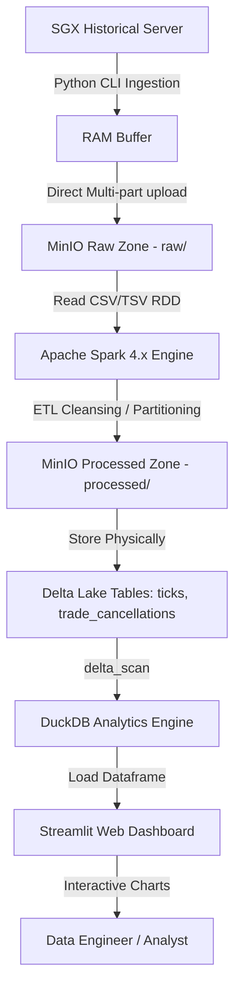

# SGX Derivatives Daily Downloader & Processing Pipeline

Một hệ thống **Data Lakehouse Pipeline** hoàn chỉnh, hiệu năng cao để tự động nạp (Ingestion), xử lý (Processing) và phân tích (Analytics) dữ liệu phái sinh lịch sử hàng ngày từ Sở giao dịch Chứng khoán Singapore (**SGX - Singapore Exchange**).

Dự án áp dụng mô hình **Pure Lakehouse Architecture** với các công nghệ lõi: **Python CLI**, **MinIO (S3 compatible)** làm Raw/Processed Zone, **Apache Spark (PySpark)** xử lý phân tán dữ liệu thô sang các bảng định dạng **Delta Lake**, **DuckDB** truy vấn dữ liệu trực tiếp trên Object Store, và **Streamlit** để dựng Dashboard trực quan hóa tương tác.

---

## 1. Kiến trúc luồng dữ liệu (Architecture)



---

## 2. Cấu trúc dự án (Project Structure)

```text
SGX_Derivatives_Daily_Downloader/
├── config/
│   └── config.ini              # Cấu hình MinIO, SGX URLs, Retry & Logging
├── docker/
│   └── docker-compose.yml      # Cấu hình container chạy MinIO
├── src/
│   ├── ingestion/
│   │   ├── cli.py              # Xử lý tham số đầu vào cho CLI Ingestion
│   │   ├── downloader.py       # Tải file từ SGX và upload trực tiếp lên MinIO
│   │   ├── id_resolver.py      # Tự động phân giải ID của ngày cần tải
│   │   └── recovery.py         # Quản lý lịch sử chạy bằng SQLite (state/ingestion_runs.db)
│   ├── processing/
│   │   ├── etl_tick_data.py    # Spark ETL xử lý dữ liệu giao dịch (Tick Data CSV)
│   │   ├── etl_trade_cancel.py # Spark ETL xử lý dữ liệu giao dịch bị hủy (TC TSV)
│   │   └── maintenance.py      # Spark Maintenance chạy OPTIMIZE & VACUUM Delta tables
│   └── analytics/
│       ├── queries.py          # Báo cáo phân tích dữ liệu Delta Lake qua DuckDB
│       └── dashboard.py        # Web Dashboard trực quan tương tác bằng Streamlit
├── state/                      # Lưu trữ cơ sở dữ liệu SQLite quản lý trạng thái
├── logs/                       # Log chi tiết quá trình tải và xử lý dữ liệu
├── run_ingestion.py            # File chạy chính của tầng Ingestion (Tải thô từ SGX -> MinIO)
├── run_etl_backfill.py         # File chạy nạp bù ETL Spark cho nhiều ngày/tháng
├── requirements.txt            # Danh sách thư viện Python cần thiết
└── README.md                   # Hướng dẫn này
```

---

## 3. Điều kiện tiên quyết (Prerequisites)

* **Hệ điều hành**: Windows 10/11 (PowerShell).
* **Docker & Docker Desktop**: Để chạy MinIO container làm Object Store local.
* **Java SDK (Java 17 hoặc 21)**: Bắt buộc để chạy Apache Spark.
* **Apache Spark 4.1.1 (Scala 2.13)**: Bộ máy xử lý dữ liệu lớn.
* **Python (3.11 hoặc 3.12)**: Khuyên dùng tạo một môi trường ảo Conda tên là `spark_env`.

---

## 4. Hướng dẫn cài đặt & Chạy chi tiết (Setup & Run Guide)

### Bước 1: Khởi động Object Store (MinIO)
Mở PowerShell tại thư mục gốc dự án và khởi động container MinIO:
```powershell
docker-compose -f docker/docker-compose.yml up -d
```
*Giao diện API MinIO sẽ chạy tại cổng `http://localhost:9000` (Access Key/Secret Key mặc định: `minioadmin`).*

### Bước 2: Cài đặt thư viện Python
Kích hoạt môi trường Conda `spark_env` và cài đặt các thư viện cần thiết (bao gồm Streamlit và Plotly):
```powershell
conda activate spark_env
pip install -r requirements.txt
```

### Bước 3: Chạy Ingestion CLI (Tải dữ liệu thô)
Chạy script nạp để tự động phân giải ID, tải file ZIP/TXT cấu trúc từ SGX và lưu thẳng vào thư mục `raw/` trên MinIO:
```powershell
# Nạp dữ liệu của ngày hôm nay
python run_ingestion.py --mode today

# Hoặc nạp một khoảng ngày lịch sử (ví dụ từ 2026-03-01 đến 2026-04-30)
python run_ingestion.py --mode history --start-date 2026-03-01 --end-date 2026-04-30
```

### Bước 4: Chạy Spark ETL (Xử lý dữ liệu sang Delta Lake)

Để chạy Spark ETL (dù chạy nạp bù hàng loạt nhiều ngày hay chạy cho một ngày đơn lẻ), bạn chỉ cần sử dụng script `run_etl_backfill.py`. 
Script này sẽ tự động cấu hình các biến môi trường Spark (trỏ vào môi trường Conda Python, thư mục lưu tạm trên ổ E để bảo vệ dung lượng ổ C, và Ivy Cache), đồng thời chạy cô lập từng ngày trong tiến trình riêng biệt để tránh lỗi Out Of Memory (OOM).

#### Chạy nạp bù hàng loạt (Backfill nhiều ngày/tháng)
```powershell
# Ví dụ nạp bù toàn bộ dữ liệu tháng 3 và tháng 4
python run_etl_backfill.py --start-date 2026-03-15 --end-date 2026-04-30
```

#### Chạy cho một ngày đơn lẻ
```powershell
# Ví dụ chạy cho một ngày cụ thể (ngày 29/05/2026)
python run_etl_backfill.py --start-date 2026-05-29 --end-date 2026-05-29
```

### Bước 5: Chạy phân tích dữ liệu qua DuckDB
Truy vấn trực tiếp trên các bảng Delta Lake lưu trong MinIO bằng công cụ DuckDB in-memory siêu tốc:
```powershell
python src/analytics/queries.py
```

### Bước 6: Khởi chạy Web Dashboard trực quan tương tác
Mở giao diện biểu đồ trực quan hóa dữ liệu bằng Streamlit trên trình duyệt web:
```powershell
streamlit run src/analytics/dashboard.py
```
*Giao diện dashboard sẽ tự động mở tại địa chỉ `http://localhost:8501`.*

### Bước 7: Bảo trì Delta Lake Store (Maintenance)
Chạy tác vụ bảo trì định kỳ để nén file nhỏ (**OPTIMIZE**) và dọn dẹp các lịch sử giao dịch thừa vượt quá 7 ngày (**VACUUM**):
```powershell
python src/processing/maintenance.py
```

---

## 5. Các điểm lưu ý kỹ thuật (Troubleshooting)

1. **Lỗi `ModuleNotFoundError: No module named 'boto3'` hoặc Java/S3A Class trong Spark**: Thường xảy ra khi chạy thủ công bằng `spark-submit` mà chưa cấu hình đúng biến môi trường Spark trỏ đến Conda Python hoặc thiếu các gói thư viện Maven. Khuyên dùng chạy qua script `run_etl_backfill.py` để tự động hóa thiết lập các biến môi trường này chuẩn xác.
2. **Lỗi `NumberFormatException: For input string: "60s"`**: Xảy ra trên Spark 4.x do các tham số thời gian chờ mặc định của S3A chứa chữ cái (`60s`). Mã nguồn đã được cấu hình ghi đè toàn bộ các tham số này về dạng số nguyên mili-giây (`60000`).
3. **Lỗi kết nối IP `169.254.169.254` trong DuckDB**: Do extension `delta_scan` của DuckDB tự động tìm kiếm thông tin tài khoản AWS EC2 IMDS qua mạng. Dự án đã cấu hình chuyển sang sử dụng `CREATE SECRET` API mới của DuckDB để chỉ định trực tiếp tài khoản MinIO local.
