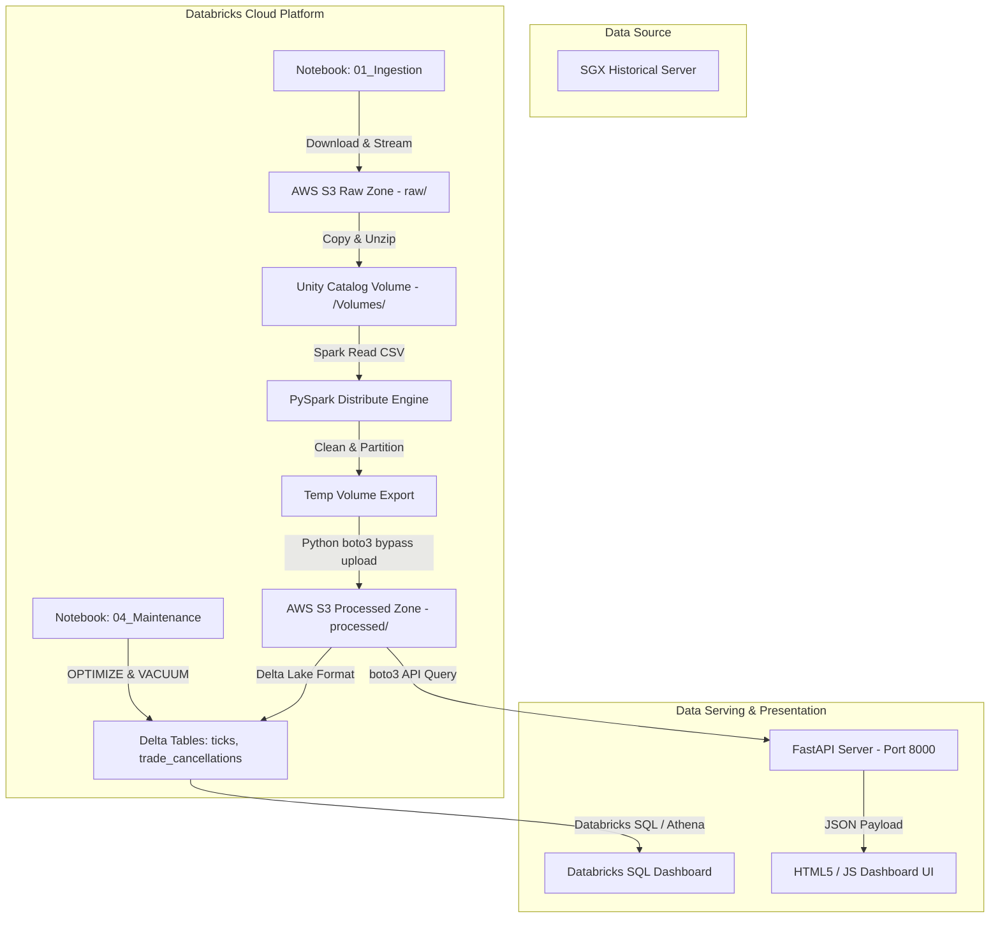
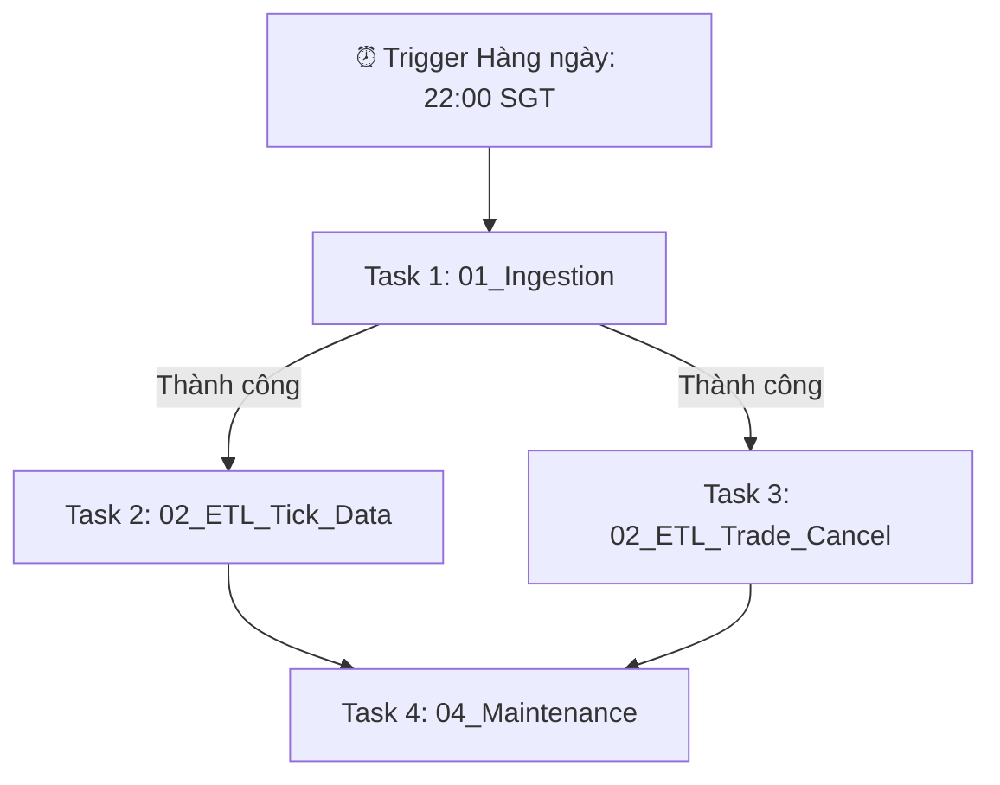

# SGX Derivatives Cloud Lakehouse Pipeline (Databricks Edition)

Một hệ thống **Cloud Data Lakehouse Pipeline** hoàn chỉnh, tự động hóa toàn diện và hiệu năng cao, được thiết kế chuyên biệt để chạy trên nền tảng **Databricks Cloud Engine** nhằm nạp (Ingestion), xử lý (Processing), lưu trữ (Lakehouse Storage) và phân tích (Analytics) dữ liệu phái sinh lịch sử hàng ngày từ Sở giao dịch Chứng khoán Singapore (**SGX - Singapore Exchange**).

---

## 🛠️ Công nghệ cốt lõi

Dự án áp dụng mô hình **Pure Cloud Lakehouse Architecture** với các công nghệ:


---

## 📐 1. Kiến trúc luồng dữ liệu (Cloud Architecture)

Hệ thống được vận hành hoàn toàn trên **Databricks** kết hợp với **AWS S3 Object Storage**, giải quyết triệt để các rào cản về bảo mật hệ thống tệp và giới hạn hạ tầng của phiên bản Cloud Serverless/Community Edition:



---

## 📁 2. Cấu trúc thư mục (Project Structure)

```text
SGX_Derivatives_Daily_Downloader/
├── databricks_pipeline/         # Pipeline chạy trên nền tảng Cloud Databricks
│   ├── 01_Ingestion.py          # Notebook nạp dữ liệu thô từ SGX -> AWS S3 (Raw Zone)
│   ├── 02_ETL_Tick_Data.py      # Notebook ETL xử lý dữ liệu Ticks -> Delta Table
│   ├── 02_ETL_Trade_Cancel.py   # Notebook ETL xử lý dữ liệu Hủy lệnh (Trade Cancel) -> Delta Table
│   ├── 03_Backfill.py           # Notebook nạp bù dữ liệu hàng loạt nhiều ngày
│   ├── 04_Maintenance.py        # Notebook tối ưu hóa Delta Lake (OPTIMIZE & VACUUM)
│   ├── DATABRICKS_S3_GUIDE.md   # Hướng dẫn chi tiết vượt rào cản S3 Config & Community Edition
│   └── README.md                # Hướng dẫn setup chi tiết trên Databricks
│
├── dashboard/                   # Dashboard trực quan hóa dữ liệu xử lý xong từ S3
│   ├── frontend/                # Giao diện HTML/JS tương tác cực đẹp
│   ├── app.py                   # FastAPI backend kết nối trực tiếp với S3
│   ├── requirements.txt         # Các gói Python cần thiết để chạy Dashboard
│   └── OPTIMIZATION_GUIDE.md    # Hướng dẫn tối ưu hóa UI & Cache
│
├── databricks_migration_plan.md # Kế hoạch chi tiết từ Local Spark lên Cloud Databricks
├── local_pipeline/              # [Legacy] Thư mục chứa code local cũ (MinIO & PySpark Local)
└── README.md                    # Tài liệu tổng quan dự án (File này)
```

---

## ⚡ 3. Cơ chế vượt rào cản Cloud Sandbox (Bypass Architecture)

Khi chạy trên hệ thống Databricks Serverless hoặc Compute Shared (bao gồm cả Bản Miễn phí Community Edition), Databricks chặn quyền ghi đè cấu hình Hadoop S3A (`fs.s3a.access.key`) và cấm ghi trực tiếp bằng giao thức `s3a://`.

Dự án áp dụng thiết kế trung chuyển qua **Unity Catalog Volumes** kết hợp **boto3 upload** để vượt qua các giới hạn này:
1. **Raw Ingestion**: File `.zip` từ SGX được nạp qua HTTPS và upload trực tiếp lên `s3://` bằng `boto3` client.
2. **Intermediate Extraction**: Do Spark không hỗ trợ native file ZIP nhiều phần, notebook sẽ tải file `.zip` từ S3 xuống SSD tạm của Driver, giải nén trực tiếp vào Unity Catalog Volume (`/Volumes/hive_metastore/sgx_lakehouse/temp_volume`).
3. **ETL Cleansing**: PySpark đọc file `.csv` thô cực nhanh từ Volume, thực hiện lọc schema, ép kiểu, phân vùng theo ngày giao dịch (`TradeDateParsed`) và ghi đè vào thư mục xuất tạm của Volume.
4. **S3 Delivery (Bypass)**: Một tiến trình Python (`boto3`) quét thư mục xuất trên Volume, tự động xóa file rác, định danh lại tên tệp thành tệp chuẩn (ví dụ: `part_0.csv`) rồi đẩy lên S3.

> [!NOTE]
> Giải pháp này giúp hệ thống vận hành trơn tru trên mọi nền tảng Databricks mà không phụ thuộc vào quyền Admin Cluster hay các cấu hình IAM Instance Profile đắt đỏ.

---

## 🚀 4. Hướng dẫn cài đặt & Chạy trên Databricks

### Bước 1: Chuẩn bị Bucket AWS S3
1. Tạo một bucket S3 trên AWS Console (ví dụ: `sgx-derivatives-daily-data-079`).
2. Tạo IAM User và cấp quyền đọc/ghi (`s3:PutObject`, `s3:GetObject`, `s3:DeleteObject`, `s3:ListBucket`) vào bucket này. Lưu lại `Access Key ID` và `Secret Access Key`.

### Bước 2: Đăng nhập Databricks CLI và tạo Secrets
Cài đặt Databricks CLI trên máy tính của bạn:
```powershell
winget install Databricks.DatabricksCLI
```
Đăng nhập vào Workspace của bạn:
```powershell
databricks auth login --host https://<databricks-instance>.cloud.databricks.com
```
Chạy các lệnh sau để tạo Secret Scope và lưu trữ an toàn các Keys:
```powershell
# 1. Tạo scope bảo mật
databricks secrets create-scope sgx-scope

# 2. Nhập Access Key
databricks secrets put-secret sgx-scope aws-access-key

# 3. Nhập Secret Key
databricks secrets put-secret sgx-scope aws-secret-key
```

### Bước 3: Cài đặt Schema & Volume trên Databricks
Mở giao diện Databricks, chạy lệnh SQL sau trong SQL Editor hoặc Notebook để tạo không gian làm việc:
```sql
CREATE SCHEMA IF NOT EXISTS sgx_lakehouse;
CREATE VOLUME IF NOT EXISTS sgx_lakehouse.temp_volume;
```

### Bước 4: Đồng bộ mã nguồn lên Databricks
Bạn có thể đồng bộ nhanh thư mục `databricks_pipeline/` lên Workspace bằng CLI:
```powershell
databricks workspace import-dir ./databricks_pipeline /Users/<your-email-address>/databricks_pipeline
```
Hoặc liên kết trực tiếp Git repo của bạn thông qua tính năng **Git Folders** trong Databricks Workspace.

### Bước 5: Cấu hình và Tự động hóa Pipeline bằng Databricks Workflows
Để tự động hóa hoàn toàn quy trình xử lý dữ liệu hàng ngày, hãy tạo một Job trong mục **Workflows**:



**Cấu hình các Task:**
*   **Task 1**: Trỏ tới notebook `01_Ingestion.py`.
*   **Task 2**: Trỏ tới notebook `02_ETL_Tick_Data.py` (chạy song song với Task 3).
*   **Task 3**: Trỏ tới notebook `02_ETL_Trade_Cancel.py`.
*   **Task 4**: Trỏ tới notebook `04_Maintenance.py` (dọn dẹp và nén tối ưu Delta Lake sau khi xử lý xong).

**Tham số truyền vào (Job Widgets):**
*   `bucket`: Tên S3 bucket của bạn (ví dụ: `sgx-derivatives-daily-data-079`)
*   `secret_scope`: `sgx-scope`
*   `date`: Bỏ trống (Hệ thống tự nhận diện ngày hiện tại) hoặc nhập ngày định dạng `YYYY-MM-DD` để nạp thủ công.

---

## 📊 5. Cài đặt Dashboard giám sát
Dashboard cung cấp giao diện trực quan cực đẹp để tương tác với dữ liệu phân tích đã xử lý từ S3.

### 1. Cấu hình biến môi trường
Di chuyển vào thư mục `dashboard/` và tạo file `.env`:
```env
AWS_ACCESS_KEY_ID=your_access_key
AWS_SECRET_ACCESS_KEY=your_secret_key
AWS_DEFAULT_REGION=ap-southeast-1
AWS_BUCKET_NAME=sgx-derivatives-daily-data-079
```

### 2. Cài đặt & Khởi chạy ứng dụng
Cài đặt thư viện:
```powershell
pip install -r requirements.txt
```
Khởi chạy FastAPI server:
```powershell
python app.py
```
Mở tệp [index.html](file:///e:/DataEngineer/DE/Class3/SGX_Derivatives_Daily_Downloader/dashboard/frontend/index.html) bằng trình duyệt web để theo dõi dashboard trực quan với các biểu đồ về khối lượng giao dịch phái sinh và thống kê các lệnh hủy lịch sử.

---

## 🛠️ 6. Bảo trì & Tối ưu hóa Delta Lake
Delta Tables lưu trên Cloud cần được dọn dẹp định kỳ để tránh sinh file rác phiên bản cũ (vốn gây tăng chi phí lưu trữ S3). 

Notebook `04_Maintenance.py` thực hiện:
*   **OPTIMIZE**: Nén các file phân tán nhỏ thành các file lớn hơn để tối ưu hóa IO khi quét dữ liệu.
*   **VACUUM RETAIN 168 HOURS**: Dọn dẹp triệt để các phiên bản cũ đã tồn tại hơn 7 ngày, giúp giảm dung lượng lưu trữ trên bucket.

---

> [!IMPORTANT]
> **Khuyến nghị Vận hành Cloud**: Luôn giữ `date` trống trong Databricks Workflow để hệ thống tự động dò tìm dữ liệu hàng ngày. Chỉ sử dụng Notebook `03_Backfill.py` khi cần nạp bù khối lượng lớn dữ liệu lịch sử.
