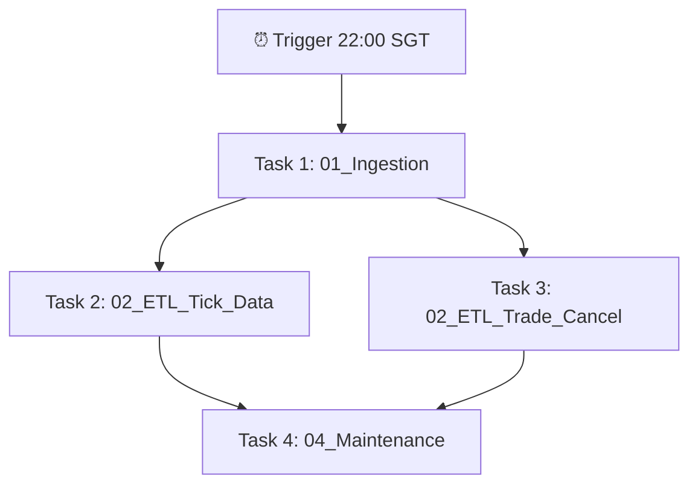

# Hướng dẫn chạy Pipeline trên Databricks

Thư mục này chứa toàn bộ các Notebook được thiết kế riêng để chạy trực tiếp trên **Databricks Cluster** kết nối với Cloud Storage (AWS S3 hoặc Azure ADLS Gen2).

---

## 1. Import Notebooks vào Databricks

Bạn có thể liên kết Git Repo này trực tiếp với Databricks thông qua **Databricks Repos**:
1. Trong màn hình Databricks, click vào **Repos** -> **Add Repo**.
2. Dán link Git repository của bạn.
3. Các file `.py` trong thư mục `databricks_notebooks/` sẽ tự động hiển thị dưới dạng **Databricks Notebooks**.

---

## 2. Cấu hình Bảo mật (Databricks Secrets)

Để bảo mật các thông tin truy cập AWS S3/Azure Blob (nếu không sử dụng IAM Instance Profile):
Sử dụng **Databricks CLI** trên máy cá nhân để tạo Secret Scope:

```bash
# 1. Tạo scope có tên là "sgx-scope"
databricks secrets create-scope --scope sgx-scope

# 2. Thêm AWS Access Key
databricks secrets put --scope sgx-scope --key aws-access-key

# 3. Thêm AWS Secret Key
databricks secrets put --scope sgx-scope --key aws-secret-key
```

*Lưu ý: Notebook `01_Ingestion` sẽ tự động tìm kiếm các key này trong scope `sgx-scope`. Nếu bạn gắn sẵn IAM Role (Instance Profile) vào Databricks Cluster, bạn có thể bỏ qua bước này vì `boto3.client('s3')` sẽ tự xác thực qua IAM.*

---

## 3. Khởi tạo Database và Cluster

Trước khi chạy Notebook lần đầu:
1. Đảm bảo Cluster của bạn có quyền ghi vào Bucket Cloud.
2. Tạo database trên Databricks để lưu trữ bảng log:
   ```sql
   CREATE DATABASE IF NOT EXISTS sgx_lakehouse;
   ```

---

## 4. Thứ tự thực thi và Cấu hình Workflow

Để tự động hóa hoàn toàn quy trình tải và xử lý hàng ngày:
1. Vào mục **Workflows** -> **Create Job**.
2. Thiết lập cấu hình các task theo trình tự sau:



### Chi tiết tham số cho các Task (Widgets):
*   `date`: Bỏ trống (tự động lấy ngày hiện tại)
*   `bucket`: Nhập tên bucket của bạn (ví dụ: `your-bucket-name`)
*   `secret_scope`: `sgx-scope`
