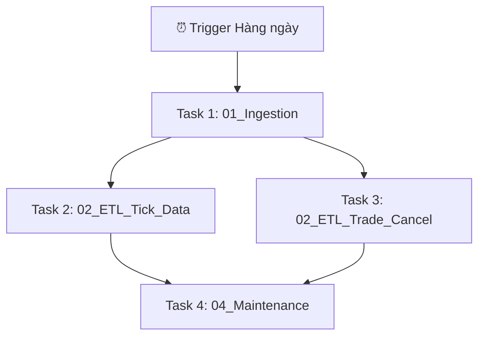

# Hướng dẫn chạy Pipeline trên Databricks

Thư mục này chứa toàn bộ các Notebook được thiết kế riêng để chạy trực tiếp trên **Databricks Cluster** kết nối với Cloud Storage (AWS S3 hoặc Azure ADLS Gen2).

---

## 1. Chuẩn bị Tài nguyên AWS S3
Trước khi bắt đầu, bạn cần có một Storage Bucket trên AWS S3:
1. Đăng nhập vào AWS Console, tìm dịch vụ S3 và nhấn **Create Bucket**.
2. **Bucket name**: Đặt tên viết thường, không khoảng trắng và phải **duy nhất trên toàn cầu** (ví dụ: `sgx-derivatives-daily-data-079`).
3. **Region**: Nên chọn vùng trùng với Databricks Cluster của bạn (ví dụ: `ap-southeast-1` - Singapore) để tối ưu hóa hiệu năng và giảm chi phí truyền dữ liệu.
4. **AWS Credentials**: Tạo một tài khoản IAM User có quyền Read/Write vào S3 Bucket này và lấy thông tin `Access Key ID` và `Secret Access Key`.

---

## 2. Cấu hình Bảo mật (Databricks Secrets)
Để bảo mật thông tin AWS credentials không bị lộ trong code notebook:

> **Yêu cầu: Cài đặt Databricks CLI**
> Nếu bạn chưa có Databricks CLI trên Windows, hãy mở PowerShell (hoặc Terminal) và chạy lệnh sau để cài đặt:
> ```powershell
> winget install Databricks.DatabricksCLI
> ```
> *(Sau khi cài đặt xong, bạn cần **tắt và mở lại** PowerShell để hệ thống nhận diện lệnh `databricks`)*.
> Tiếp theo, đăng nhập vào Databricks Workspace của bạn bằng lệnh:
> `databricks auth login --host <workspace-url>`
> *(Điền host URL dạng rút gọn: `https://<databricks-instance>.cloud.databricks.com`)*

Chạy các lệnh sau trong Terminal máy cá nhân để tạo Secret Scope:
```bash
# 1. Tạo scope có tên là "sgx-scope"
databricks secrets create-scope sgx-scope

# 2. Thêm AWS Access Key (Nhập key khi được hỏi và bấm Enter)
databricks secrets put-secret sgx-scope aws-access-key

# 3. Thêm AWS Secret Key (Nhập key khi được hỏi và bấm Enter)
databricks secrets put-secret sgx-scope aws-secret-key
```

---

## 3. Cấu hình Quyền truy cập S3 cho Spark (Lưu ý về Serverless/Shared Compute)
Do các hệ thống Databricks Serverless Compute hoặc Shared Cluster chặn việc ghi đè trực tiếp Hadoop cấu hình (`spark.conf.set("fs.s3a.access.key", ...)`) trong Notebook vì lý do an toàn bảo mật, bạn cần chọn một trong các cách cấu hình sau:

### Cách A: Cấu hình Spark Config tại Cluster Level (Chuẩn Production - Khuyên dùng)
1. Trên giao diện Web Databricks, chọn **Compute** -> Chọn Cluster của bạn -> Nhấn **Edit**.
2. Chọn **Advanced Options** -> Chọn tab **Spark**.
3. Dán các dòng cấu hình sau vào ô **Spark Config**:
   ```text
   spark.hadoop.fs.s3a.access.key {{secrets/sgx-scope/aws-access-key}}
   spark.hadoop.fs.s3a.secret.key {{secrets/sgx-scope/aws-secret-key}}
   ```
4. Nhấn **Confirm & Restart Cluster**. Sau khi khởi động lại, Spark sẽ tự động có quyền đọc/ghi S3 qua giao thức `s3a://`.

### Cách B: Chuyển sang Cluster loại "Single User"
Nếu sử dụng Cluster dành riêng cho một người dùng (Single User Access Mode):
* Bạn có thể tự do ghi đè cấu hình trong Notebook bằng lệnh:
  ```python
  access_key = dbutils.secrets.get(scope="sgx-scope", key="aws-access-key")
  secret_key = dbutils.secrets.get(scope="sgx-scope", key="aws-secret-key")
  spark.conf.set("fs.s3a.access.key", access_key)
  spark.conf.set("fs.s3a.secret.key", secret_key)
  ```

### Cách C: Sử dụng IAM Instance Profile
Nếu Cluster được gắn trực tiếp AWS IAM Role có quyền đọc/ghi S3 Bucket, bạn có thể bỏ qua toàn bộ bước nhập key. Spark sẽ tự động sử dụng quyền của Cluster để đọc ghi trực tiếp bằng giao thức `s3://`.

---

## 4. Kiểm tra Kết nối S3 nhanh bằng Notebook (Boto3)
Bạn có thể chạy kiểm tra kết nối từ Notebook lên S3 bằng Python Boto3 (không bị chặn trên Serverless):
```python
import boto3

access_key = dbutils.secrets.get(scope="sgx-scope", key="aws-access-key")
secret_key = dbutils.secrets.get(scope="sgx-scope", key="aws-secret-key")

s3_client = boto3.client('s3', aws_access_key_id=access_key, aws_secret_access_key=secret_key)
try:
    response = s3_client.list_objects_v2(Bucket="your-bucket-name")
    print("Kết nối AWS S3 thành công!")
except Exception as e:
    print("Lỗi kết nối:", e)
```

---

## 5. Đẩy Code lên Databricks (Deploy Notebooks)
Việc trong repository của bạn có cả thư mục `local_pipeline` và `databricks_pipeline` không gây bất kỳ ảnh hưởng hay lỗi gì đến hệ thống Databricks. Bạn chỉ cần đồng bộ riêng thư mục `databricks_pipeline` lên.

### Cách 1: Sử dụng Databricks CLI (Upload nhanh từ máy local)
Chạy lệnh sau trong Terminal máy cá nhân để đẩy code lên thư mục cá nhân của bạn:
```powershell
databricks workspace import-dir ./databricks_pipeline /Users/<your-email-address>/databricks_pipeline
```

### Cách 2: Đồng bộ qua Git Integration
1. Đẩy toàn bộ source code của bạn lên GitHub repository cá nhân.
2. Trên giao diện Databricks, chọn **Workspace** -> **Git Folders** -> Chọn **Add Git Folder**.
3. Dán link clone của Git Repo vào và nhấn **Create Git Folder**. Bạn chỉ cần mở các file trong thư mục `databricks_pipeline/` để làm việc.

---

## 6. Khởi tạo Database và Volume (Unity Catalog)
Mã nguồn đã được thiết kế tự động khởi tạo Schema (`sgx_lakehouse`) và Volume (`temp_volume`) dưới Catalog hiện hành.
Tuy nhiên, bạn cũng có thể chạy thủ công các câu lệnh SQL sau trong Databricks để khởi tạo:
```sql
CREATE SCHEMA IF NOT EXISTS sgx_lakehouse;
CREATE VOLUME IF NOT EXISTS sgx_lakehouse.temp_volume;
```

---

## 7. Thứ tự thực thi và Cấu hình Workflow
Để tự động hóa hoàn toàn quy trình tải và xử lý hàng ngày:
1. Vào mục **Workflows** -> **Create Job**.
2. Thiết lập cấu hình các task theo trình tự sau:



### Chi tiết tham số cho các Task (Widgets):
*   `date`: Bỏ trống (tự động lấy ngày hiện tại)
*   `bucket`: Nhập tên bucket của bạn (ví dụ: `sgx-derivatives-daily-data-079`)
*   `secret_scope`: `sgx-scope`
