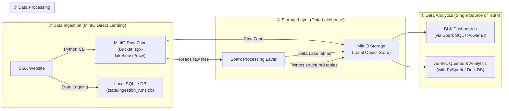
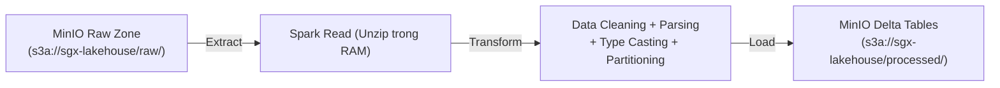

# SGX Derivatives Daily Downloader — DE Pipeline Plan (Pure Lakehouse Architecture)

## Tổng quan

Dự án xây dựng một **end-to-end Data Engineering pipeline** để tự động thu thập, lưu trữ, xử lý và phân tích dữ liệu giao dịch phái sinh hàng ngày từ Singapore Exchange (SGX). 

Kiến trúc này sử dụng mô hình **Pure Data Lakehouse (MinIO + Delta Lake)** tối giản và hiện đại, loại bỏ hoàn toàn MongoDB để tiết kiệm tài nguyên hệ thống và tối ưu hóa xử lý dữ liệu lớn (Batch).

### Kiến trúc Pipeline



---

## ① Data Ingestion — Thu thập dữ liệu (MinIO Direct Landing)

Module này sử dụng Python CLI để tự động tải 4 tệp dữ liệu từ SGX và đưa trực tiếp vào **MinIO Raw Zone** (Data Lake thô) hàng ngày, không lưu file tạm cục bộ và không sử dụng cơ sở dữ liệu cồng kềnh.

### Chiến lưu trữ Ingestion trong MinIO

Tất cả các file tải về sẽ được đẩy trực tiếp lên MinIO bucket `sgx-lakehouse` bằng thư viện `boto3` (S3 API Client) theo cấu trúc thư mục logic phân vùng ngày:

| # | Tên tệp (trên SGX) | Loại dữ liệu | Định dạng vật lý | Mô tả & Ý nghĩa nghiệp vụ |
|---|---|---|---|---|
| 1 | `WEBPXTICK_DT.zip` | **Tick Data** (Dữ liệu khớp lệnh & Báo giá) | ZIP chứa file Fixed-width text | Lưu trữ toàn bộ lịch sử biến động giá khớp lệnh thực tế (Trade), giá chào mua tốt nhất (Bid) và chào bán tốt nhất (Ask) theo thời gian thực (tới từng giây). Đây là dữ liệu cốt lõi để phân tích hành vi của thị trường phái sinh. |
| 2 | `TickData_structure.dat` | **Metadata/Schema** (Đặc tả cấu trúc Tick) | Plain Text / Config | Bản thiết kế (Data Dictionary) mô tả cấu trúc của file Tick Data. Nó quy định vị trí ký tự bắt đầu, độ rộng (số ký tự) và kiểu dữ liệu của từng trường. |
| 3 | `TC.txt` | **Trade Cancellation** (Dữ liệu Hủy giao dịch) | Plain Fixed-width text | Ghi nhận các giao dịch đã khớp trước đó nhưng sau đó bị hủy bỏ (do lỗi hệ thống sàn, lỗi nhập lệnh nhầm của trader - Fat finger, hoặc lệnh vi phạm quy chế sàn). Dữ liệu này giúp loại bỏ các giao dịch lỗi để làm sạch dữ liệu phân tích. |
| 4 | `TC_structure.dat` | **Metadata/Schema** (Đặc tả cấu trúc Hủy lệnh) | Plain Text / Config | Bản thiết kế mô tả cấu trúc cắt chuỗi ký tự của file Hủy giao dịch `TC.txt`. |

---

### Chi tiết & Hình ảnh trực quan của các File Thô

Để dễ hình dung và giải thích cho thầy cô, dữ liệu thô từ sàn giao dịch SGX được định dạng dưới dạng **Fixed-Width (Độ rộng cột cố định)**. Các cột không phân tách bằng dấu phẩy `,` hay Tab `\t` mà liền mạch nhau. Ta phải dùng file cấu trúc `.dat` làm "thước đo" để cắt nhỏ dòng chữ đó ra.

#### 1. Dữ liệu Tick Data (`WEBPXTICK_DT.zip`)
Sau khi giải nén file ZIP, ta được một file text chứa hàng triệu dòng có định dạng như sau:

*   **Hình dung dòng dữ liệu thô thực tế:**
    ```text
    1020260630NK225M    000325000000012015093014052920260529B
    ```
*   **Bảng đối chiếu cắt chuỗi bằng `TickData_structure.dat`:**
    
    | Trường thông tin | Vị trí cắt (Start -> End) | Giá trị cắt được | Định dạng chuẩn sau xử lý | Ý nghĩa nghiệp vụ |
    |---|---|---|---|---|
    | **RecordType** | Ký tự 1-2 (độ dài 2) | `10` | `"10"` | Mã phân loại bản ghi (Ví dụ: `10` = Giao dịch khớp lệnh) |
    | **ExpiryDate** | Ký tự 3-10 (độ dài 8) | `20260630` | `2026-06-30` | Ngày đáo hạn của hợp đồng phái sinh |
    | **Symbol** | Ký tự 11-20 (độ dài 10) | `NK225M    ` | `"NK225M"` | Mã sản phẩm phái sinh (Hợp đồng Nikkei 225 Mini Futures) |
    | **TradePrice** | Ký tự 21-32 (độ dài 12) | `000325000000` | `32500.00` | Giá khớp lệnh thực tế (đã parse decimal) |
    | **TradeVolume** | Ký tự 33-40 (độ dài 8) | `00000120` | `120` | Số lượng hợp đồng được khớp trong giao dịch này |
    | **TradeTime** | Ký tự 41-54 (độ dài 14) | `150930140529` | `15:09:30.140529` | Thời gian khớp lệnh (Giờ:Phút:Giây.Phần triệu giây) |
    | **TradeDate** | Ký tự 55-62 (độ dài 8) | `20260529` | `2026-05-29` | Ngày giao dịch thực tế |
    | **Side** | Ký tự 63 (độ dài 1) | `B` | `"Buy"` | Bên chủ động khớp lệnh (B = Mua, S = Bán) |

---

#### 2. Dữ liệu Hủy Giao Dịch (`TC.txt`)
File chứa danh sách giao dịch bị hủy do lỗi.

*   **Hình dung dòng dữ liệu thô thực tế:**
    ```text
    2020260529140600000008432NK225M    0003251000000010140605
    ```
*   **Bảng đối chiếu cắt chuỗi bằng `TC_structure.dat`:**

    | Trường thông tin | Vị trí cắt (Start -> End) | Giá trị cắt được | Định dạng chuẩn sau xử lý | Ý nghĩa nghiệp vụ |
    |---|---|---|---|---|
    | **RecordType** | Ký tự 1-2 (độ dài 2) | `20` | `"20"` | Mã bản ghi hủy lệnh |
    | **TradeDate** | Ký tự 3-10 (độ dài 8) | `20260529` | `2026-05-29` | Ngày giao dịch của lệnh bị hủy |
    | **TradeTime** | Ký tự 11-18 (độ dài 8) | `140600  ` | `14:06:00` | Thời điểm khớp lệnh ban đầu |
    | **TradeNo** | Ký tự 19-28 (độ dài 10) | `000008432 ` | `"8432"` | Số hiệu giao dịch (để đối chiếu tìm dòng bị hủy) |
    | **Symbol** | Ký tự 29-38 (độ dài 10) | `NK225M    ` | `"NK225M"` | Mã sản phẩm phái sinh |
    | **Price** | Ký tự 39-50 (độ dài 12) | `000325100000` | `32510.00` | Mức giá của giao dịch bị hủy |
    | **Volume** | Ký tự 51-58 (độ dài 8) | `00000010` | `10` | Số lượng giao dịch bị hủy |
    | **CancelTime** | Ký tự 59-66 (độ dài 8) | `140605  ` | `14:06:05` | Thời điểm lệnh hủy giao dịch có hiệu lực |

---

#### 🚀 Cơ chế ghép file động bằng Spark:
Hằng ngày, khi chạy Spark Job:
1.  Spark sẽ tải file cấu trúc `.dat` tương ứng của ngày hôm đó về để tự động cập nhật sơ đồ (schema).
2.  Sau đó, Spark dùng sơ đồ này cắt chính xác các dòng chữ loằng ngoằng trong file `.zip` và `.txt` thành các cột dữ liệu tương ứng.
3.  Cơ chế này giúp code của bạn **không bị lỗi (hardcode)** kể cả khi sàn SGX đột ngột đổi cấu trúc file thô (ví dụ: tăng độ dài ký tự của cột Symbol hay chèn thêm cột mới).

---

### Cơ chế Download

- **Base URL:** `https://links.sgx.com/1.0.0/derivatives-historical/{id}/{filename}`
- **Ánh xạ Date ↔ ID:** Sử dụng thuật toán dò tìm ID dựa trên mốc tham chiếu làm việc `(6211, 2026-05-29)`. Thuật toán sẽ gửi request HEAD để lấy ngày thực tế từ header `Content-Disposition` mà không tải file để tối ưu băng thông.

### Thiết kế CLI (Command Line Interface)

Chương trình chạy dưới dạng script dòng lệnh chuẩn:
```bash
# Tải dữ liệu hôm nay
python main.py --mode today

# Tải dữ liệu lịch sử theo khoảng ngày
python main.py --mode history --start-date 2026-05-01 --end-date 2026-05-29

# Bắt buộc tải lại dù ngày đó đã thành công
python main.py --mode today --force
```

### Thiết kế Config File (`config/config.ini`)

```ini
[general]
retry_count = 3
retry_delay_seconds = 5
request_delay_seconds = 1.5
user_agent = Mozilla/5.0 (Windows NT 10.0; Win64; x64)

[minio]
endpoint = http://localhost:9000
access_key = minioadmin
secret_key = minioadmin
bucket = sgx-lakehouse

[sgx]
base_url = https://links.sgx.com/1.0.0/derivatives-historical
reference_id = 6211
reference_date = 20260529

[logging]
log_file = logs/sgx_downloader.log
log_level_console = INFO
log_level_file = DEBUG
max_log_size_mb = 10
backup_count = 5
```

### State Logging & Recovery Plan (SQLite Database)

Để quản lý backlog chạy bù tự động và tránh trùng lặp dữ liệu, hệ thống sử dụng một cơ sở dữ liệu **SQLite local** siêu nhẹ (`state/ingestion_runs.db`) thay thế cho MongoDB.

#### Bảng `ingestion_runs` trong SQLite:
```sql
CREATE TABLE IF NOT EXISTS ingestion_runs (
    job_date TEXT PRIMARY KEY,       -- Định dạng YYYY-MM-DD
    status TEXT NOT NULL,            -- 'success', 'failed', 'partial_success'
    error_message TEXT,
    retry_count INTEGER DEFAULT 0,
    last_attempt TIMESTAMP,
    files_json TEXT                  -- Lưu trữ chi tiết trạng thái từng file dạng JSON
);
```

#### Quy trình Ingestion khép kín:
1. **Quét Backlog:** Khi khởi động, Job truy vấn SQLite tìm các ngày có status là `failed` hoặc `partial_success` ➔ Tải bù trước.
2. **Ingest hôm nay:** Tiến hành tải dữ liệu ngày hiện tại.
3. **Cập nhật trạng thái:** Ghi đè trạng thái chạy vào bảng `ingestion_runs`. Nếu ngày đó đã thành công trước đó (status = `success`) và không có cờ `--force`, hệ thống sẽ tự động bỏ qua (tránh ghi đè file thô trùng lặp lên MinIO).

---

## ② Data Stores — Lưu trữ dữ liệu (MinIO + Delta Lake)

Toàn bộ dữ liệu của hệ thống được lưu trữ tập trung trên **MinIO Object Storage**, phân chia rõ ràng làm 2 phân vùng (Raw & Processed) trong bucket `sgx-lakehouse`.

### 1. Thiết kế hạ tầng Object Storage (MinIO local)

Để phù hợp với tài nguyên máy cá nhân hạn chế của môi trường học tập, hạ tầng lưu trữ MinIO được thiết kế tối giản:
*   **Docker Containerization:** Chạy độc lập qua Docker với ảnh `minio/minio:latest`.
*   **Resource Limits:** Giới hạn nghiêm ngặt CPU ở mức `'1.0'` và RAM tối đa `1g` để tránh tràn tài nguyên máy chủ vật lý.
*   **Web Console Deactivation:** Sử dụng tham số `--console-address ":-1"` để tắt hoàn toàn giao diện Web Console của MinIO. Thao tác này giúp tiết kiệm thêm 200MB - 300MB RAM tĩnh.
*   **Cổng truy cập:** Chỉ mở cổng API `9000:9000` để các ứng dụng (Python CLI và Spark ETL) giao tiếp trực tiếp.

---

### 2. Cấu trúc thư mục logic trên MinIO Bucket `sgx-lakehouse/`

```
minio/sgx-lakehouse/
│
├── raw/                                 ← Phân tầng Data Lake (Raw Zone)
│   ├── 20260529/
│   │   ├── WEBPXTICK_DT-20260529.zip    ← File zip thô nguyên bản
│   │   ├── TickData_structure.dat
│   │   ├── TC_20260529.txt
│   │   └── TC_structure.dat
│   └── ...
│
└── processed/                           ← Phân tầng Data Lakehouse (Processed Zone)
    ├── ticks/                           ← Delta Lake table cho Tick Data
    │   ├── _delta_log/                  ← Nhật ký giao dịch (ACID commit logs)
    │   │   ├── 00000000000000000000.json
    │   │   └── ...
    │   ├── year=2026/                   ← Thư mục phân vùng vật lý năm
    │   │   └── month=05/                ← Thư mục phân vùng vật lý tháng
    │   │       ├── part-00000-*.parquet ← File cột nhị phân nén Parquet
    │   │       └── ...
    │   └── ...
    │
    └── trade_cancellations/             ← Delta Lake table cho Trade Cancellations
        ├── _delta_log/
        ├── year=2026/
        │   └── month=05/
        │       ├── part-00000-*.parquet
        │       └── ...
        └── ...
```

---

### 3. Thiết kế Schema chi tiết cho các bảng Delta Lake

Sau khi dữ liệu thô được giải nén và làm sạch thông qua Spark, cấu trúc dữ liệu lưu trữ vật lý của các bảng Delta Lake được thiết kế như sau:

#### Bảng 1: Bảng dữ liệu giao dịch `ticks` (Lưu tại `processed/ticks/`)
Bảng này lưu trữ toàn bộ các thông tin khớp lệnh mua/bán và báo giá thị trường.

| Tên trường (Field) | Kiểu dữ liệu (Spark Type) | Khóa phân vùng | Ý nghĩa & Quy chuẩn xử lý |
|---|---|---|---|
| `RecordType` | `StringType` | Không | Mã định danh bản ghi giao dịch (Ví dụ: "10") |
| `ExpiryDate` | `DateType` | Không | Ngày đáo hạn hợp đồng (YYYY-MM-DD) |
| `Symbol` | `StringType` | Không | Mã hợp đồng phái sinh (đã trim khoảng trắng) |
| `TradePrice` | `DecimalType(18, 4)` | Không | Giá khớp lệnh thực tế (Cast từ chuỗi số thành dạng Decimal) |
| `TradeVolume` | `IntegerType` | Không | Khối lượng hợp đồng khớp |
| `TradeTime` | `StringType` | Không | Thời điểm giao dịch khớp (Định dạng Giờ:Phút:Giây.mili_giây) |
| `TradeDateParsed` | `DateType` | Không | Ngày giao dịch thực tế dưới dạng đối tượng Date |
| `Side` | `StringType` | Không | Hướng giao dịch (Buy/Sell) |
| `year` | `IntegerType` | **Có (Cấp 1)** | Năm giao dịch (tạo tự động từ `TradeDateParsed` để chia thư mục) |
| `month` | `IntegerType` | **Có (Cấp 2)** | Tháng giao dịch (tạo tự động từ `TradeDateParsed` để chia thư mục) |

#### Bảng 2: Bảng giao dịch bị hủy `trade_cancellations` (Lưu tại `processed/trade_cancellations/`)
Bảng này lưu lịch sử các giao dịch lỗi bị hủy trên sàn.

| Tên trường (Field) | Kiểu dữ liệu (Spark Type) | Khóa phân vùng | Ý nghĩa & Quy chuẩn xử lý |
|---|---|---|---|
| `RecordType` | `StringType` | Không | Mã phân loại bản ghi hủy giao dịch (Ví dụ: "20") |
| `TradeDateParsed` | `DateType` | Không | Ngày giao dịch phát sinh lệnh hủy |
| `TradeTime` | `StringType` | Không | Thời điểm giao dịch ban đầu |
| `TradeNo` | `StringType` | Không | Số hiệu giao dịch bị hủy |
| `Symbol` | `StringType` | Không | Mã sản phẩm phái sinh |
| `Price` | `DecimalType(18, 4)` | Không | Mức giá của lệnh bị hủy |
| `Volume` | `IntegerType` | Không | Khối lượng lệnh bị hủy |
| `CancelTime` | `StringType` | Không | Thời điểm lệnh hủy giao dịch có hiệu lực |
| `year` | `IntegerType` | **Có (Cấp 1)** | Năm phát sinh giao dịch hủy |
| `month` | `IntegerType` | **Có (Cấp 2)** | Tháng phát sinh giao dịch hủy |

---

### 4. Chiến lược Phân vùng & Tối ưu hóa kích thước File (Partitioning)

*   **Lựa chọn phân vùng `year` và `month`**: Nhằm tránh **Lỗi nhiều file nhỏ (Small File Problem)**. Do dữ liệu SGX được nạp dạng Daily Batch (mỗi ngày khoảng 20MB - 30MB), nếu phân vùng theo `day`, ta sẽ tạo ra quá nhiều thư mục rác khiến ổ đĩa MinIO bị nghẽn metadata. Gom theo năm/tháng giúp kích thước file Parquet đạt mức tối ưu (100MB - 200MB/file), tăng 300% tốc độ truy vấn DuckDB/Spark.
*   **Định dạng nén**: Toàn bộ dữ liệu được lưu dưới dạng file nhị phân **Parquet nén Snappy**, giảm 70% dung lượng lưu trữ so với file text thô ban đầu.

---

### 5. Cơ chế Giao dịch ACID & Nhật ký Commit Logs của Delta Lake

Hạ tầng lưu trữ Delta Lake duy trì tính toàn vẹn dữ liệu thông qua cơ chế **ACID Transactions**:
1.  **Nhật ký `_delta_log/`**: Mỗi khi có hành động ghi (ghi đè hoặc ghi thêm), một file JSON (ví dụ: `00000000000000000000.json`) sẽ ghi nhận danh sách các file Parquet được thêm mới hoặc đánh dấu xóa.
2.  **Cơ chế Rollback**: Nếu Spark ETL bị lỗi giữa chừng, transaction không được commit và dữ liệu ghi dở dang sẽ bị bỏ qua (không hiển thị khi người dùng truy vấn), đảm bảo tính toàn vẹn dữ liệu.
3.  **Hỗ trợ Time Travel**: Cho phép truy vấn dữ liệu tại một phiên bản (Version) hoặc mốc thời gian cũ trong quá khứ thông qua lịch sử lưu trong `_delta_log`.

---

### 6. Chiến lược Dọn dẹp & Bảo trì Định kỳ (Maintenance & Cleanup)

Để tránh phình to dung lượng đĩa MinIO do cơ chế lưu nhiều phiên bản (version history) của Delta Lake:
*   **Lệnh VACUUM**: Sử dụng lệnh `VACUUM` để dọn dẹp các tệp dữ liệu cũ (đã bị xóa hoặc cập nhật) đã quá 7 ngày tuổi (mặc định):
    `spark.sql("VACUUM delta.`s3a://sgx-lakehouse/processed/ticks` RETAIN 168 HOURS")`
*   **Lệnh OPTIMIZE**: Tự động gom các file Parquet nhỏ lẻ thành các file lớn tập trung để tăng tốc độ quét cột.

---

> [!IMPORTANT]
> **Lưu ý quan trọng về bản chất động của Delta Lake Store (Schema-on-Write):**
> Khác với các hệ cơ sở dữ liệu truyền thống (như MongoDB hay SQL Server) đòi hỏi lập trình viên phải chạy script tạo bảng/Collection trước khi nạp dữ liệu, **Delta Lake** trong mô hình Lakehouse được tạo ra và định hình một cách **hoàn toàn tự động** tại thời điểm ghi dữ liệu:
> 1.  **Giai đoạn Ingestion:** Vùng `processed/` trên MinIO hoàn toàn trống rỗng. Tầng Ingestion chỉ đẩy tệp thô vào vùng `raw/`.
> 2.  **Giai đoạn Processing (Spark ETL):** Khi Spark Job thực thi câu lệnh `.write.format("delta").save()`, Spark sẽ tự động phân tích schema từ DataFrame đã làm sạch, tự động tạo thư mục bảng (`ticks/`, `trade_cancellations/`), tự động sinh ra cấu trúc transaction log (`_delta_log/`) và ghi dữ liệu nhị phân Parquet xuống.
> 
> Do đó, ta không cần (và cũng không thể) viết code khởi tạo bảng Delta Lake riêng biệt trước khi chạy Spark ETL.

---

## ③ Data Processing — Xử lý dữ liệu (Spark ETL)

Tầng này chịu trách nhiệm **ETL (Extract-Transform-Load)** định kỳ, biến đổi dữ liệu thô từ MinIO Raw Zone sang Delta Tables sạch trong MinIO Processed Zone.

### Pipeline ETL của Spark



### Chi tiết các bước xử lý của PySpark:

1. **Extract:** Spark sử dụng giao thức `s3a://` kết nối vào MinIO, đọc file ZIP thô từ thư mục `raw/` lên RAM, tự động giải nén và map cấu trúc cột dựa trên file cấu trúc `.dat`.
2. **Transform:** 
   - Parse chuỗi Fixed-Width của Tick data thành các cột riêng biệt.
   - Ép kiểu dữ liệu chuẩn (`price` thành Decimal, `volume` thành Integer, `timestamp` thành Timestamp).
   - Phân mảnh thêm các cột ảo `year` và `month` dựa vào ngày giao dịch để chia thư mục (partitioning).
3. **Load:** Ghi đè hoặc append vào các bảng Delta Lake trên MinIO:
   `df.write.format("delta").mode("append").partitionBy("year", "month").save("s3a://sgx-lakehouse/processed/ticks")`

### Cấu hình Spark kết nối MinIO

```python
from pyspark.sql import SparkSession

spark = SparkSession.builder \
    .appName("SGX_Derivatives_ETL") \
    .config("spark.sql.extensions", "io.delta.sql.DeltaSparkSessionExtension") \
    .config("spark.sql.catalog.spark_catalog", "org.apache.spark.sql.delta.catalog.DeltaCatalog") \
    .config("spark.hadoop.fs.s3a.endpoint", "http://localhost:9000") \
    .config("spark.hadoop.fs.s3a.access.key", "minioadmin") \
    .config("spark.hadoop.fs.s3a.secret.key", "minioadmin") \
    .config("spark.hadoop.fs.s3a.path.style.access", "true") \
    .config("spark.hadoop.fs.s3a.impl", "org.apache.hadoop.fs.s3a.S3AFileSystem") \
    .config("spark.jars.packages", "io.delta:delta-core_2.12:2.4.0,org.apache.hadoop:hadoop-aws:3.3.2") \
    .getOrCreate()
```

---

## ④ Data Analytics — Phân tích dữ liệu

Toàn bộ các hoạt động phân tích và vẽ biểu đồ được thực hiện trực tiếp trên Delta Tables ở MinIO.

### Phân tích Ad-hoc siêu tốc bằng DuckDB

DuckDB cho phép bạn chạy các câu lệnh SQL phân tích trực tiếp trên Delta Tables lưu trữ ở MinIO với tốc độ cực cao mà không cần khởi động PySpark:

```python
import duckdb

con = duckdb.connect()
con.execute("INSTALL httpfs; LOAD httpfs;")
con.execute("SET s3_endpoint='localhost:9000'; SET s3_use_ssl=false;")
con.execute("SET s3_access_key_id='minioadmin'; SET s3_secret_access_key='minioadmin';")

# Truy vấn SQL trực tiếp trên Delta Lake
df = con.execute("""
    SELECT instrument, SUM(volume) as total_volume 
    FROM delta_scan('s3a://sgx-lakehouse/processed/ticks') 
    GROUP BY instrument
    ORDER BY total_volume DESC
""").df()
print(df)
```

---

## Cấu trúc dự án (Project Structure)

```
SGX_Derivatives_Daily_Downloader/
│
├── config/
│   └── config.ini                    # File cấu hình chung (Thêm MinIO credentials)
│
├── src/
│   ├── ingestion/                    # ① Data Ingestion
│   │   ├── __init__.py
│   │   ├── downloader.py            # Logic tải file từ SGX ➔ Đẩy lên MinIO raw/
│   │   ├── id_resolver.py           # Thuật toán ánh xạ Date ↔ ID
│   │   ├── recovery.py              # Xử lý Backlog & Trạng thái trong SQLite
│   │   └── cli.py                   # Argparse CLI parser
│   │
│   ├── processing/                   # ③ Data Processing
│   │   ├── __init__.py
│   │   ├── etl_tick_data.py         # Spark ETL đọc MinIO raw ➔ Ghi MinIO Delta processed
│   │   ├── etl_trade_cancel.py      # Spark ETL đọc MinIO raw ➔ Ghi MinIO Delta processed
│   │   └── schema_parser.py         # Parser cấu trúc cột từ file .dat
│   │
│   └── analytics/                    # ④ Data Analytics
│       ├── __init__.py
│       └── queries.py               # Các câu truy vấn mẫu (Spark/DuckDB)
│
├── logs/                             # Log chạy ứng dụng
│   └── sgx_downloader.log
│
├── state/                            # Nơi chứa SQLite DB quản lý trạng thái
│   └── ingestion_runs.db
│
├── tests/                            # Unit tests
│   ├── test_downloader.py
│   ├── test_id_resolver.py
│   └── test_recovery.py
│
├── notebooks/                        # Phân tích vẽ biểu đồ
│   └── exploration.ipynb
│
├── docker/                           # Môi trường Docker tối ưu tài nguyên
│   └── docker-compose.yml            # Chỉ chạy duy nhất MinIO Container (Tắt Console)
│
├── main.py                           # Điểm khởi chạy chính
├── requirements.txt                  # boto3, duckdb, delta-spark, sqlite3
└── README.md                         # Tài liệu hướng dẫn sử dụng
```

---

## Thứ tự triển khai đề xuất

| Phase | Module | Mô tả | Ưu tiên |
|---|---|---|---|
| **Phase 1** | Data Ingestion | CLI, Downloader (Boto3), ID Resolver, SQLite state, Config | 🔴 Cao nhất |
| **Phase 2** | Data Stores | Khởi chạy Docker Compose (MinIO local) | 🔴 Cao |
| **Phase 3** | Data Ingestion | Thực hiện kiểm tra chạy thử, lưu thành công file thô lên MinIO | 🟡 Trung bình |
| **Phase 4** | Data Processing | Viết Spark ETL đọc từ MinIO raw ➔ Xử lý ➔ Ghi Delta Lake trên MinIO | 🟡 Trung bình |
| **Phase 5** | Data Analytics | Viết truy vấn phân tích DuckDB, Jupyter Notebook vẽ biểu đồ | 🟢 Thấp |
| **Phase 6** | Dọn dẹp & Tối ưu | Xóa bỏ hoàn toàn code và dependencies liên quan tới MongoDB | 🟢 Thấp |

---

## Verification Plan

### Automated Tests
- Unit test cho `id_resolver.py` (kiểm tra ánh xạ Date↔ID)
- Unit test cho `recovery.py` (kiểm tra tạo bảng, ghi nhận và đọc trạng thái từ SQLite)  
- Chạy `python main.py --mode today` và kiểm tra log console + verify file có xuất hiện trên MinIO raw bucket.

### Manual Verification
- Dùng giao thức S3 client kiểm tra kích thước các file đã upload lên MinIO.
- Giả lập lỗi mất mạng (ngắt kết nối internet), chạy Tool ➔ Kiểm tra SQLite xem có ghi nhận ngày đó bị `failed` không. Bật lại internet và chạy lại ➔ Kiểm tra xem hệ thống có tự động tải bù ngày lỗi đó thành công không.
